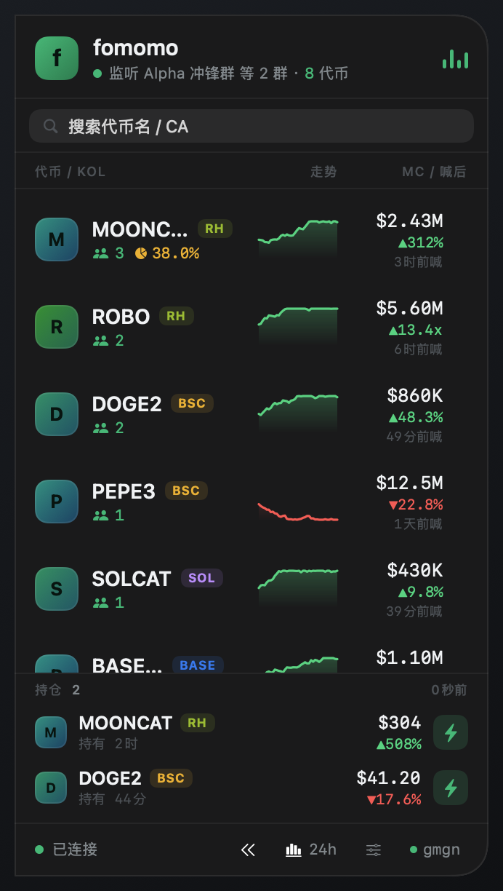
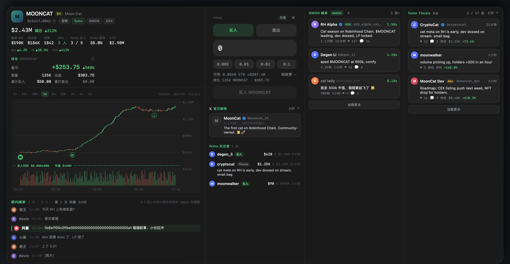
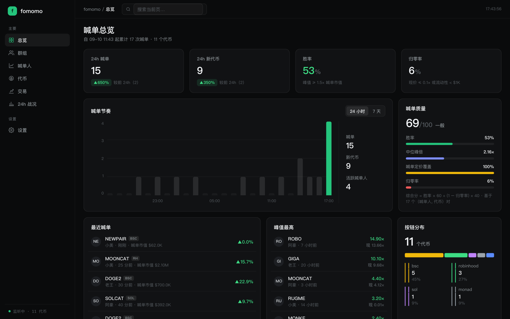
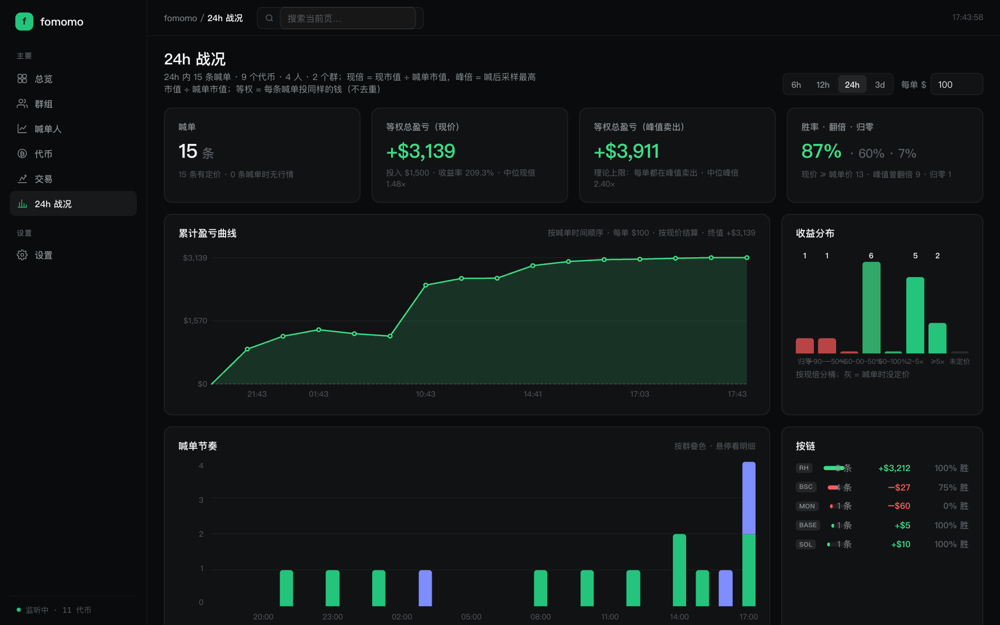

# fomomo

macOS 桌面端「群喊单」监控悬浮窗。盯着你选定的微信 / 飞书群，群里一冒出代币合约地址就抓下来：实时行情、K 线、喊单后涨跌、谁喊的、喊了几次；新币主动弹卡；看准了可以直接在卡上一键买卖。

<p align="center">
  
</p>
<p align="center">
  
</p>

> 截图为演示数据。

## 功能

- **悬浮窗**：贴屏幕左缘、置顶、不抢焦点、跨 Space。每行一个代币：符号 / 链 / 喊单人数 / 迷你走势 / 市值 / 自首次喊单以来的涨跌 / 距首喊多久。顶部搜索代币名或合约地址；底部「持仓」区列出热钱包里的币，闪电按钮行内快捷买卖。
- **弹卡**：点行打开（新币自动弹出）。市值 K 线（1s–1d，喊单时刻打标记、持仓画买卖均价线）、群内喊单原文与前后语境、官方推特 / 社区推文（附中文译文）、fomo.family 关注者动向与 Thesis、GMGN 喊单，以及交易卡。
- **一键买卖**：本地 burner 热钱包签名，OKX DEX 路由；买入按原生币数量（ETH / BNB / SOL / MON）计价，卖出按持仓比例；单笔 / 每日 USD 上限；支持 Ethereum / BSC / Base / Monad / Robinhood / Solana。
- **dashboard**（本地网页）：总览、群组勾选、喊单人战绩、代币列表、交易与持仓、24h 战况（累计盈亏曲线 / 收益分布 / 按链按群按人 / 错过的金狗）、面板设置。

<p align="center">
  
  
</p>

## 环境要求

- macOS 14+，Apple Silicon
- 读微信群：微信 macOS 4.x 已登录；提取密钥需要 Xcode 命令行工具（`xcode-select --install`，引导页里有按钮）
- 读飞书群：不需要额外安装，`.app` 自带 lark-cli，用你本人账号在浏览器里授权一次

## 安装

从 [Releases](https://github.com/nishuzumi/fomomo/releases) 下载 `Fomomo-<版本>-arm64.zip`，解压后把 `Fomomo.app` 拖进「应用程序」，双击打开。应用是 accessory 类型（无 Dock 图标）：左侧出现悬浮窗，状态栏有一个 `f` 图标；退出走状态栏菜单。

> 未公证的构建（仓库没配 Developer ID 证书时 CI 产出的就是）首次打开会被 Gatekeeper 拦下「Apple 无法验证」：点「完成」→ 系统设置 → 隐私与安全性 → 底部「仍要打开」；或者终端 `xattr -cr /Applications/Fomomo.app`。macOS 15 起「右键 → 打开」已不再绕过。

`.app` 自带 Node 22 运行时和 lark-cli，不需要装 Node / pnpm。数据（设置、喊单记录、微信密钥）在 `~/Library/Application Support/fomomo/`，日志在 `~/Library/Logs/fomomo.log`。

### 首次启动：选一个群来源

第一次启动（或还没有任何群来源就绪）时，应用会自动打开 dashboard「群组」页做引导：两个来源都没配好时并排两张引导卡——**微信**和**飞书**，配好任意一个就能开始；另一个以后随时在同一页补上。若机器上已有登录过的 lark-cli，飞书直接就绪，页面会停在飞书页签让你勾群。

**微信**（直接读本机微信的聊天库，只读、不导出）：

1. 首次启动时 macOS 会弹「Fomomo 想要访问其他 App 的数据」——这是读微信容器目录的权限，点**允许**（比开完全磁盘访问权限范围小）。引导卡会检查前置条件：微信 4.x 已登录、读取微信数据的权限（刚才点了不允许的话，点「打开系统设置」改用完全磁盘访问，然后重启应用）、命令行开发者工具（点「安装」弹系统对话框）。
2. 点「在终端中提取密钥」。会打开一个终端窗口跑 `setup-keys.sh`：复制一份微信到 `~/WeChat-extract.app` 并只重签这份副本（不动 `/Applications` 原版，截图 / 录屏权限不受影响），按提示在副本里退登再登录，用 LLDB 抓一次 SQLCipher 密钥，副本自动删除。中途会要 sudo，约 3 分钟。
3. 密钥落到 `~/Library/Application Support/fomomo/secrets/all_keys.json`（权限 600，只有密钥、没有聊天内容）。引导卡自动变为「就绪」，接着列出你所有微信群，勾好点「保存」开始监听。

只有**退登 / 换号**或**微信新建了消息分片**时才需要重提；日常运行不用。

**飞书**（用你本人账号读群，不需要机器人进群，全程不用终端）：

1. 点「创建应用并登录」。第一次会在浏览器里一键创建一个只读权限的飞书应用（`im:chat:read` / `im:message:readonly` / `im:message.group_msg:get_as_user`），然后进入设备码授权页；浏览器没弹出来就复制卡上的链接手动打开。
2. 授权完成后引导卡自动变为「就绪」，切到「飞书」页签勾选要监听的群。

勾选只是草稿，点「保存」一次生效（两个来源的改动一起提交）。新加的群先回灌它最近 100 条消息（里面的合约地址按回灌喊单处理：不弹卡、喊单价取当时的分钟蜡烛），然后从当下起监听；重启应用时已选群自动回灌最近 6 小时。

## 日常使用

### 悬浮窗

- 点一行 → 弹卡；新币首次出现自动弹卡，几秒后自动收起（卡上点一下就钉住）。
- 顶部搜索框：按代币名 / 合约地址过滤，Esc 清空。
- 拖右边 / 上下边改尺寸，上下拖动移动位置；尺寸和背景不透明度也可在 dashboard「设置」页改。
- 底栏：连接状态、`«` 收起到状态栏、`24h` 直达战况页、滑块开 dashboard、`gmgn` 点表示页面代理是否就绪（红点时点它会亮出 gmgn 窗口让你过一次 Cloudflare 验证）。

### 弹卡

- K 线上方一排按钮切分辨率；图上的圆点是每次喊单，点它切换下方「群内喊单」的语境。
- 右侧列：交易卡 → 官方推特 → fomo 关注者；更宽的屏幕再并排 GMGN 喊单与 fomo Thesis 两列（各有「加载更多」）。
- 头部按钮：官网 / fomo / GMGN / DEX 直达；合约地址点击复制。

### 一键买卖

> 下面的 `pnpm cli …` 是开发模式写法。装的是 `.app` 时等价命令是 `/Applications/Fomomo.app/Contents/Resources/node/bin/node /Applications/Fomomo.app/Contents/Resources/sidecar/cli.mjs …`。

1. 验链路：`pnpm cli okx-check`，应显示 ✓（不需要任何配置）。
2. 生成热钱包：弹卡 swap 区或状态栏「生成热钱包…」点一下「生成热钱包」。生成一把 EVM 地址（六条 EVM 链通用）和一把 Solana 地址，私钥只存本机 Keychain；已有钱包不会覆盖。命令行等价：`pnpm cli wallet-init`。
3. 充值：弹卡上的「充值」或状态栏「充值地址…」显示二维码和地址；往要交易的链转**小额**原生币（RH / ETH / Base 转 ETH，BSC 转 BNB，Solana 转 SOL，Monad 转 MON）。`pnpm cli wallet-show --balances true` 查余额。
4. 交易：弹卡交易卡输入原生币数量或点快捷额 → 拿到一次报价 → 点「买入 XXX」；卖出按持仓比例。持仓区每行的闪电按钮是行内快捷买卖，点了直接下单。
5. 设置：dashboard「交易」页改单笔 / 每日 USD 上限、四组买入快捷额、卖出比例、各链 RPC 覆盖（默认公共节点；Robinhood 建议 Alchemy、Solana 建议 Helius）。命令行等价：`pnpm cli trade-config --rpc-bsc https://…`。

> 热钱包边界：Keychain 只做落盘加密，任何以你身份运行的进程都读得到。只放准备买 meme 的小钱。

### gmgn 页面代理（首次可能要过一次验证）

代币行情、K 线、持有人、社区喊单都来自 gmgn，而 gmgn 的接口只能在它自己的页面里请求，所以应用内常驻了一个隐藏的 gmgn 页面。首次启动或它遇到人机验证时，底栏 `gmgn` 变红点：

1. 点底栏的 `gmgn`（或等它自己弹出），会打开窗口「gmgn · 人机验证 / 登录（完成后可关闭）」。
2. 在窗口里过一次 Cloudflare 验证（不需要注册 / 登录 gmgn 账号）。
3. 关掉窗口。底栏 `gmgn` 变绿，行情开始进来。

会话持久保存，之后一般不再打扰。

### 登录 fomo.family（可选）

登录后弹卡多出三块内容：「fomo 买入」= 我在 fomo 上关注的人里买过这个币的人数、他们的买卖 / Thesis 明细、以及「fomo 前排」比例（fomo 全站前 50 名持有量 ÷ gmgn 前排前 50 名持有量）；主面板每行也会显示前排比例的小饼图。不登录这些位置显示「未登录 fomo · 状态栏菜单登录」，其它功能不受影响。

1. 点状态栏 fomomo 图标 →「登录 fomo…」，弹出窗口「fomo.family · 登录（完成后可关闭）」。
2. 在窗口里像在浏览器里一样登录：fomo 只提供 Google / Apple / X 三种账号登录，在对应的登录页里用密码或验证码完成即可。**Passkey（通行密钥）在这个内置窗口里用不了**，别选那条路。
3. 登录成功后窗口自动收回；打开任意弹卡，右栏「fomo 关注者」出现数据即为成功。

登录态保存在应用自己的数据仓里，fomo 页面会自动续期，正常情况下一次登录能用一个月左右；弹卡重新显示「未登录 fomo」时按上面步骤再登一次即可。应用对 fomo 只做低频只读（一条 WebSocket + 每 15 秒一次批量查询），**不会**用你的 fomo 账号下单或发帖——但 fomo 服务条款禁止自动化抓取，是否登录由你自己权衡。

## 常见问题

| 现象 | 处理 |
|---|---|
| 群组页微信卡显示「没有完全磁盘访问权限」/ 日志报 `EPERM` / `SQLITE_CANTOPEN` | 系统设置 → 隐私与安全性 → 完全磁盘访问权限，加上 Fomomo（开发模式：启动它的那个终端）再重启 |
| 报 `database is locked` | 微信正在写库；一般会自愈，持续出现就退出微信重开 |
| 微信卡显示「密钥已失效」（读不到新消息 / 打不开库） | 退登换号或新分片：在群组页重新「在终端中提取密钥」 |
| 飞书卡显示未登录 / 权限不足 | 授权过期或应用没拿到只读权限：群组页重新「登录飞书」 |
| sidecar 秒退无限重启（开发模式） | node 大版本和 native addon 的 ABI 不匹配：确认用的是 `.node-version` 里的 22.x，或 `pnpm rebuild` |
| 行情一直空、`gmgn` 红点 | gmgn 页面遇到 Cloudflare 验证：点底栏 `gmgn` 亮窗手动过一次 |
| 行情时有时无、DexScreener 超时 | 本机 DNS 被劫持时 sidecar 会自动走系统代理（`scutil --proxy`）；确认代理开着 |
| 下单显示「结果未知」 | 广播成功但回执迟到（常见于免费 BSC 节点）；sidecar 会持续对账并改终态，**不会自动重发**。可在 dashboard「交易」页核对 |

日志：`~/Library/Logs/fomomo.log`（只记状态和地址数，不记聊天正文）。

## 安全与隐私

- 微信原库**只读打开**，不写入、不导出；应用自己的 sqlite 只存喊单原话 + 少量前后语境，不存全量群聊。
- 微信密钥 `~/Library/Application Support/fomomo/secrets/all_keys.json` 与热钱包私钥都只在本机；飞书凭据由 `lark-cli` 管理（`.app` 自带的那份也用你本机的 lark-cli 配置目录）；fomo.family 登录态只在内置 WKWebView 里。
- 客户端不持有任何 OKX 凭据。

## 开发

需要 Node **22**（`.node-version` 钉了 22.22.0，推荐 fnm）+ pnpm，Xcode 26 / Swift 6。

```bash
pnpm install
pnpm typecheck && pnpm test        # TS：模拟合约测试，不碰真实微信库 / 网络
cd app && swift build && .build/debug/Fomomo   # 开发模式：Swift 用 fnm 里的 node 跑 `src/cli.ts`（沙盒环境用 ./build.sh）
pnpm build:app                     # 打包 dist/Fomomo.app（自带 Node 22 + esbuild 打好的 sidecar + lark-cli；ad-hoc 签名）
```

发布：`pnpm release X.Y.Z`（`scripts/release.sh`：要求 main 干净且与 origin 一致，改 `package.json` 版本 → 提交 `vX.Y.Z` → 打同名 tag → 推）。tag 一到，`.github/workflows/release.yml` 在 `macos-26` 上跑测试、`scripts/build-app.sh`，把 `Fomomo-X.Y.Z-arm64.zip` 附到同名 GitHub Release。版本号的唯一来源是 tag（`build-app.sh` 用 `git describe --exact-match`），不在 tag 上的本地 / 手动构建退回 `package.json` 的版本。仓库 secrets 里有 `MACOS_CERT_P12`（Developer ID Application，base64）+ `MACOS_CERT_PASSWORD` 就用真实身份签名并开 hardened runtime；再配 `NOTARY_KEY_P8_BASE64` / `NOTARY_KEY_ID` / `NOTARY_ISSUER_ID` 则公证 + staple。都没配 ⇒ ad-hoc 签名，用户首次打开要在「隐私与安全性」里放行。

架构与各模块设计见 [docs/ARCHITECTURE.md](docs/ARCHITECTURE.md)，术语表见 [CONTEXT.md](CONTEXT.md)，关键决策及被否掉的替代方案见 [docs/adr/](docs/adr/)。
